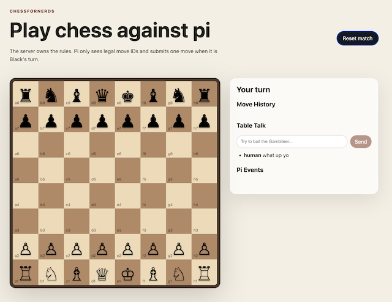
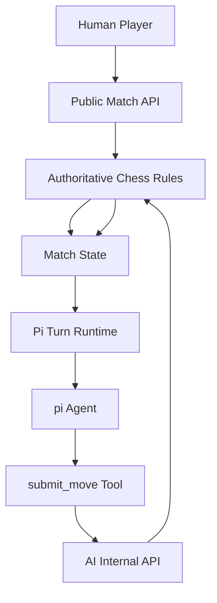

# ChessForNerds

ChessForNerds is a small browser chess game built to demonstrate a larger
architecture: using `pi` as an embedded application agent instead of building an
AI workflow around a separate graph framework.

The application owns the chess board, legal moves, turn order, validation, and
fallback behavior. The `pi` agent is given a narrow per-turn capability: choose
one server-generated move ID and submit it through the app's API.



## What We Built

- A React browser UI for playing White against an AI-controlled Black opponent.
- A Node/Express backend with `chess.js` as the authoritative rules engine.
- A scoped pi extension that exposes chess-specific tools instead of general
  filesystem or shell tools.
- A real `pi --mode rpc` turn runner that starts pi as a subprocess, streams
  observable events, enforces a deadline, and validates that a move actually
  landed.
- A deterministic fake runner used only for tests and development checks.

## The Key Idea

The model is allowed to be fuzzy because the application is precise.

Pi can reason about the position, choose a style, and add a little table talk.
It cannot invent game state. It cannot make illegal moves. It cannot decide that
its prose completed the turn. The only successful outcome is an accepted
application mutation:



## How Pi Is Integrated

On Black's turn, the server:

1. Computes the real legal move list from `chess.js`.
2. Mints a short-lived turn token.
3. Starts `pi --mode rpc` with built-in tools disabled.
4. Loads only the chess extension and chess skills.
5. Inlines the visible board and legal move IDs into the prompt.
6. Accepts exactly one `submit_move` call.
7. Re-reads match state to verify that Black actually moved.

If pi times out or fails to submit a move, the server applies a deterministic
legal fallback move so the game never hangs.

## Why This Matters

This is the pattern described in the methodology:

- The app is the state machine.
- Tools are capabilities.
- Bad actions are made unrepresentable where possible.
- Context is assembled by the app, not discovered by the agent.
- Success is a state diff, not a sentence.

That means the AI integration is ordinary application code. Chess legality
stays in the chess service. Turn ownership stays in the server. Pi supplies
judgment and personality through a constrained tool boundary.

Read the full design argument in [Pi as an Embedded Application Agent](methodology.md).

## Local Development

```bash
npm install
npm run dev
```

By default, Black is played by the real `pi` agent. For deterministic local
testing, use:

```bash
npm run dev:fake
```

Run verification with:

```bash
npm test
npm run build
```
